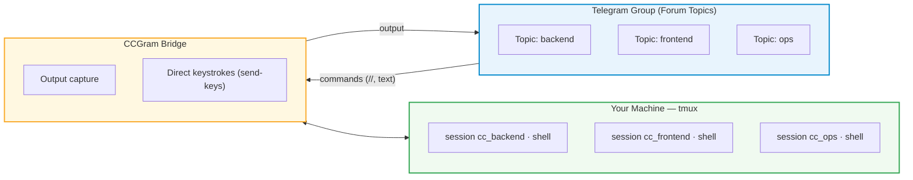

# CCGram — Direct Telegram to tmux Bridge

[](https://github.com/alexei-led/ccgram/actions/workflows/ci.yml)
[](https://pypi.org/project/ccgram/)
[](https://pypi.org/project/ccgram/)
[](https://pypi.org/project/ccgram/)
[](https://pypi.org/project/ccgram/)
[](LICENSE)
[](https://github.com/astral-sh/ruff)

**Control terminal and tmux sessions directly from Telegram.** CCGram provides a clean, direct bridge from Telegram forum topics to tmux sessions on your machine: input directories, create shell sessions, send commands, and receive output directly in Telegram.

---

## Why CCGram?

- **Direct tmux control** — operates directly on tmux windows and sessions without fragile transcript parsers or agent-specific SDK wrappers.
- **Desktop to phone, seamless continuity** — walk away from your desk and monitor your running terminal tasks from Telegram.
- **Phone back to desktop anytime** — run `tmux attach` on your machine and you are right where you left off with full scrollback.
- **Topic per session** — each Telegram topic maps directly to an isolated tmux session/window.
- **Double slash bot commands (`//`)** — keeps native single-slash `/` commands uncluttered in your shell and bot commands isolated (`//commands`, `//unbind`, `//sessions`, `//ses`).

---

## How It Works



Each Telegram Forum topic binds to a tmux session/window. Messages you send in the topic are executed in tmux; output changes are relayed back directly.

---

## Commands

- `//commands` — list available bot commands
- `//unbind` — unbind current topic from tmux window (session continues running)
- `//sessions` / `//ses` — list active bridge sessions and manage bindings

---

## Quick Start

### Prerequisites

- **Python 3.13+**
- **tmux** — installed and available in `PATH`

### Install

```bash
uv tool install ccgram          # recommended
pipx install ccgram             # pipx
```

### Configure

1. Create a Telegram bot via [@BotFather](https://t.me/BotFather)
2. In BotFather settings:
   - **Allow Groups**: On
   - **Group Privacy**: Off _(required to see topic messages)_
   - **Topics**: On
3. Add the bot to a Telegram group with Topics enabled
4. **Promote the bot to Administrator** with **Create Topics** and **Pin Messages** permissions
5. Create `~/.ccgram/.env`:

```ini
TELEGRAM_BOT_TOKEN=your_bot_token_here
ALLOWED_USERS=your_telegram_user_id
CCGRAM_GROUP_ID=your_telegram_group_id
```

> Get your user ID from [@userinfobot](https://t.me/userinfobot). Get the group ID via [@RawDataBot](https://t.me/RawDataBot) (prefix the Peer ID with `-100`).

### Run

```bash
ccgram
```

Open your Telegram group, create topic `foo`, and send a message. ccgram binds it to tmux session `cc_foo`; if that session does not exist, ccgram creates it. To hand an existing session `foo` to ccgram, rename it to `cc_foo` first.


---

## Configuration Reference

| Variable / Flag                | Default                        | Description                                                                                                 |
| ------------------------------ | ------------------------------ | ----------------------------------------------------------------------------------------------------------- |
| `TELEGRAM_BOT_TOKEN`           | _(required)_                   | Bot token from @BotFather (env only)                                                                        |
| `ALLOWED_USERS`                | _(required)_                   | Comma-separated Telegram user IDs                                                                           |
| `CCGRAM_DIR`                   | `~/.ccgram`                    | Config and state directory                                                                                  |
| `CCGRAM_PROVIDER`              | `claude`                       | Default provider (`claude`, `codex`, `gemini`, `pi`, `shell`)                                               |
| `CCGRAM_<NAME>_COMMAND`        | _(from provider)_              | Override launch command per provider                                                                        |
| `CCGRAM_GROUP_ID`              | _(all groups)_                 | Restrict to one Telegram group                                                                              |
| `CCGRAM_HIDE_TOOL_CALLS`       | `true`                         | Global default for hiding `tool_use`/`tool_result` messages                                                 |
| `CCGRAM_TOPIC_STATUS_DIFF_INTERVAL` | `10`                      | Minimum seconds between status diff edits/sends                                                             |
| `CCGRAM_LLM_PROVIDER`          | _(disabled)_                   | LLM for shell command generation + completion summaries                                                     |
| `CCGRAM_LLM_API_KEY`           | _(empty)_                      | LLM API key (env only)                                                                                      |
| `CCGRAM_WHISPER_PROVIDER`      | _(disabled)_                   | Whisper provider for voice transcription (`openai`, `groq`)                                                 |
| `CCGRAM_TTS_PROVIDER`          | _(disabled)_                   | TTS backend for voice replies: `edge` (free, no key) or `openai`. `edge` requires `pip install ccgram[tts]` |
| `CCGRAM_TTS_VOICE`             | `en-US-EmmaMultilingualNeural` | Voice name. For `edge`: any edge-tts voice. For `openai`: `alloy`, `nova`, `shimmer`, etc.                  |
| `CCGRAM_TTS_MODEL`             | `gpt-4o-mini-tts`              | OpenAI TTS model. Only used when `CCGRAM_TTS_PROVIDER=openai`                                               |
| `CCGRAM_TTS_API_KEY`           | _(empty)_                      | API key for OpenAI TTS. Falls back to `OPENAI_API_KEY` if unset                                             |
| `CCGRAM_LIVE_VIEW_INTERVAL`    | `5`                            | Live view refresh interval in seconds                                                                       |
| `CCGRAM_LIVE_VIEW_TIMEOUT`     | `300`                          | Live view auto-stop timeout in seconds                                                                      |
| `CCGRAM_SEND_SEARCH_DEPTH`     | `5`                            | Max directory depth for `/send` file search                                                                 |
| `CCGRAM_SEND_MAX_RESULTS`      | `50`                           | Max file results returned by `/send` search                                                                 |
| `CCGRAM_FILE_SIZE_LIMIT_MB`    | `1024`                         | Maximum file size for Telegram uploads and `//send`, in MB                                                  |
| `AUTOCLOSE_DONE_MINUTES`       | `30`                           | Auto-close completed topics after N minutes                                                                 |
| `AUTOCLOSE_DEAD_MINUTES`       | `10`                           | Auto-close dead sessions after N minutes                                                                    |
| `CCGRAM_PANE_LIFECYCLE_NOTIFY` | `false`                        | Default for per-window pane create/close notifications                                                      |
| `CCGRAM_MINIAPP_BASE_URL`      | _(disabled)_                   | Externally reachable HTTPS URL for the Mini App dashboard                                                   |
| `CCGRAM_MINIAPP_HOST`          | `127.0.0.1`                    | Local aiohttp bind host for the Mini App server                                                             |
| `CCGRAM_MINIAPP_PORT`          | `8765`                         | Local aiohttp bind port for the Mini App server                                                             |

Full reference: **[docs/guides.md](docs/guides.md#configuration)**

---

## Mini App Dashboard (Optional)

CCGram ships an optional web dashboard that opens from a Telegram inline button and runs inside Telegram's WebApp container. Three surfaces are available in v3.0:

- **Live terminal** — xterm.js stream of the bound tmux pane (read-only)
- **Transcript** — paginated session history with full-text search
- **Multi-pane grid** — every pane in the window in one view; click to focus

The Mini App is **disabled by default**. When `CCGRAM_MINIAPP_BASE_URL` is unset, neither the HTTP server nor the dashboard button are exposed.

### Enable

1. Set the three Mini App env vars:

   ```ini
   CCGRAM_MINIAPP_BASE_URL=https://ccgram.example.com
   CCGRAM_MINIAPP_HOST=127.0.0.1
   CCGRAM_MINIAPP_PORT=8765
   ```

2. Terminate TLS in front of the local aiohttp server (cloudflared, caddy, or nginx). The server listens on plain HTTP at `MINIAPP_HOST:MINIAPP_PORT`; the public domain in `MINIAPP_BASE_URL` must serve it over HTTPS — Telegram WebApps refuse plain HTTP.
3. In [@BotFather](https://t.me/BotFather):
   - `/setdomain` — register your domain
   - `/newapp` — create a Mini App entry pointing to the same URL
4. Restart `ccgram`. A new "Dashboard" button appears on the status bubble.

Tokens are HMAC-signed with the bot token, scoped to a single window + user, and expire on a short clock. There is no cross-window access — every API route validates the token on every call.

### Reverse-proxy snippet (caddy)

```
ccgram.example.com {
  reverse_proxy 127.0.0.1:8765
}
```

For nginx, ensure `proxy_http_version 1.1` and the standard `Upgrade`/`Connection` headers are forwarded so the live terminal websocket works.

---

---

## Development

```bash
git clone https://github.com/alexei-led/ccgram.git
cd ccgram
uv sync --extra dev

make check        # fmt + lint + typecheck + unit + integration tests
make test         # unit tests via `uv run pytest ...`
make test-e2e     # E2E tests (requires agent CLIs, see docs/guides.md)
```

Development commands in this repo are expected to run through `uv`.
Use `make test` or `uv run pytest ...`, not a bare system `pytest`.

---

## Documentation

- **[docs/guides.md](docs/guides.md)** — CLI reference, configuration, voice messages, multi-instance setup, session recovery, testing
- **[docs/providers.md](docs/providers.md)** — Provider details (Claude, Codex, Gemini, Pi, Shell), session modes, LLM configuration, custom launch commands

---

## Migrating from ccbot

CCGram was previously named `ccbot`. If upgrading from v1.x:

```bash
pip install ccgram          # or: brew install alexei-led/tap/ccgram
mv ~/.ccbot ~/.ccgram       # migrate config directory
# Update CCBOT_* env vars → CCGRAM_* (old vars still work with deprecation warnings)
ccgram hook --install       # re-install hooks
```

---

## Acknowledgments

Inspired by [ccbot](https://github.com/six-ddc) by [six-ddc](https://github.com/six-ddc), the original Telegram-to-agent bridge. Thanks for the spark.

## License

[MIT](LICENSE)
