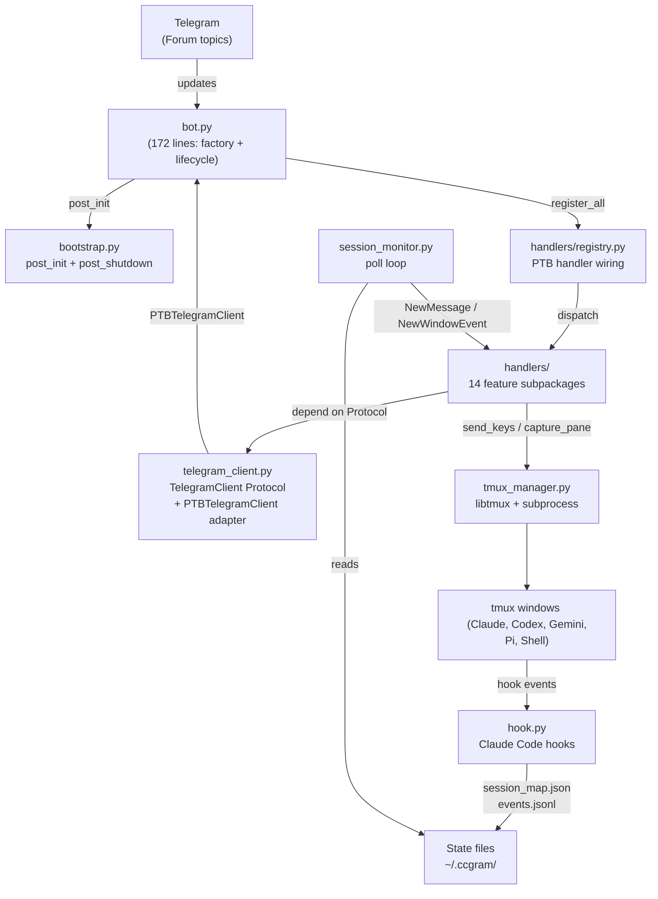
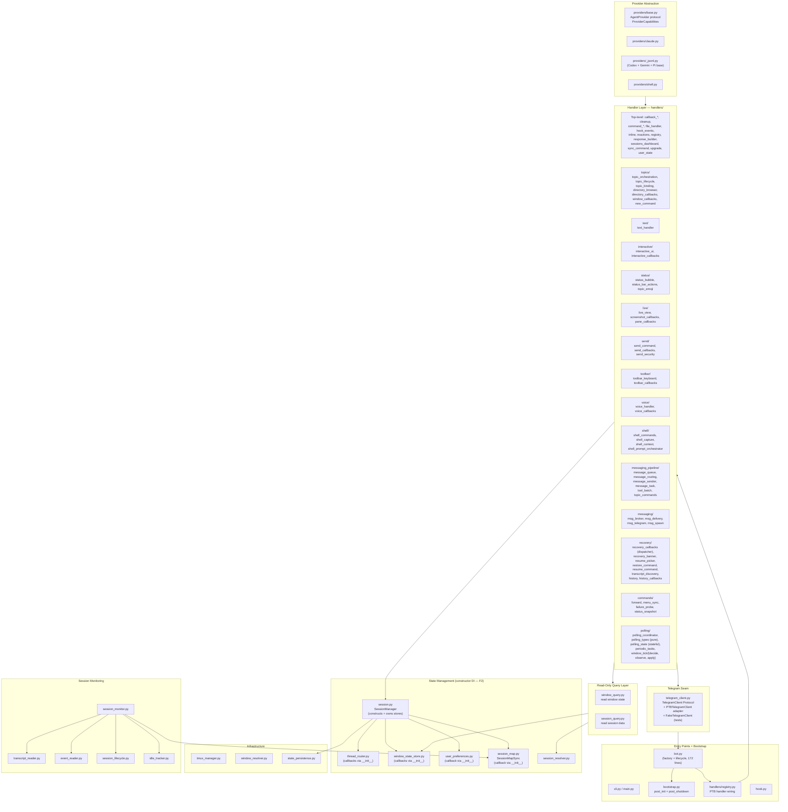
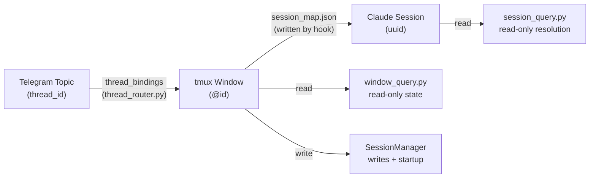
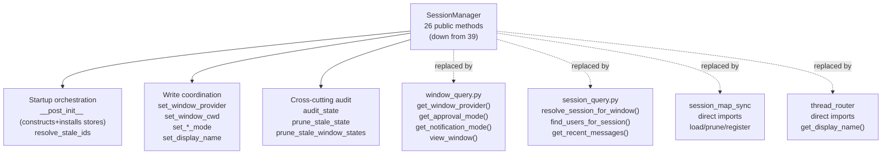
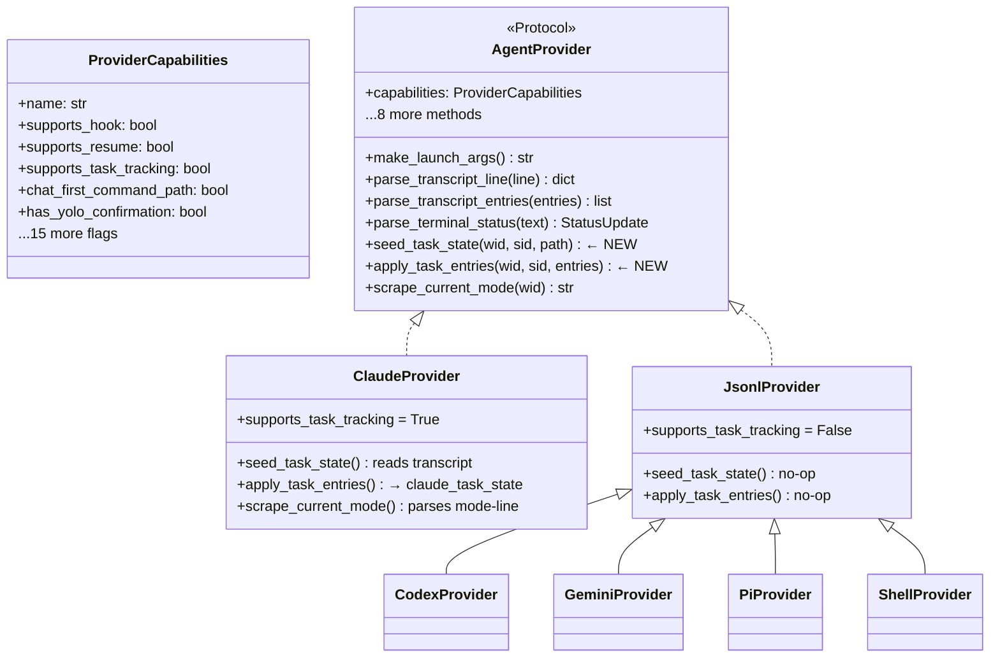
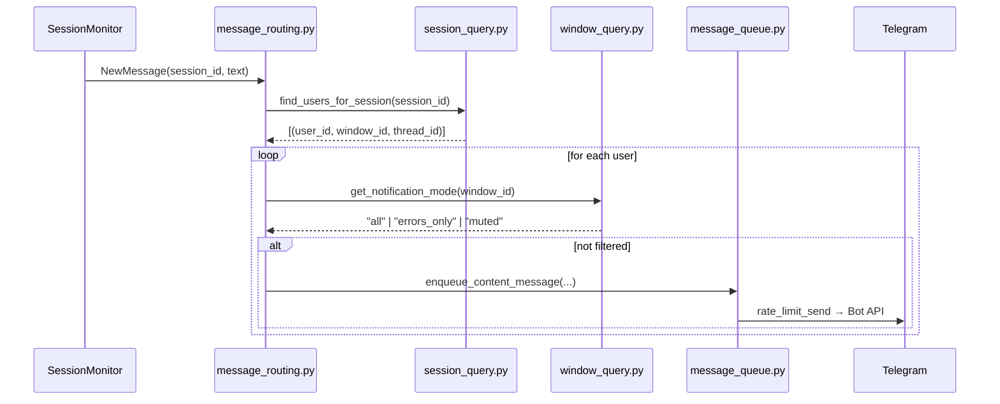
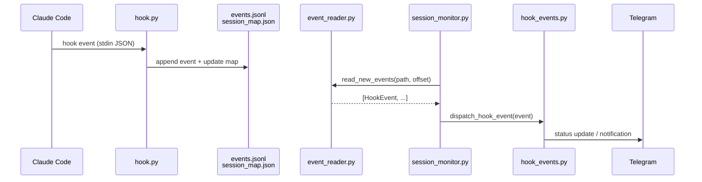
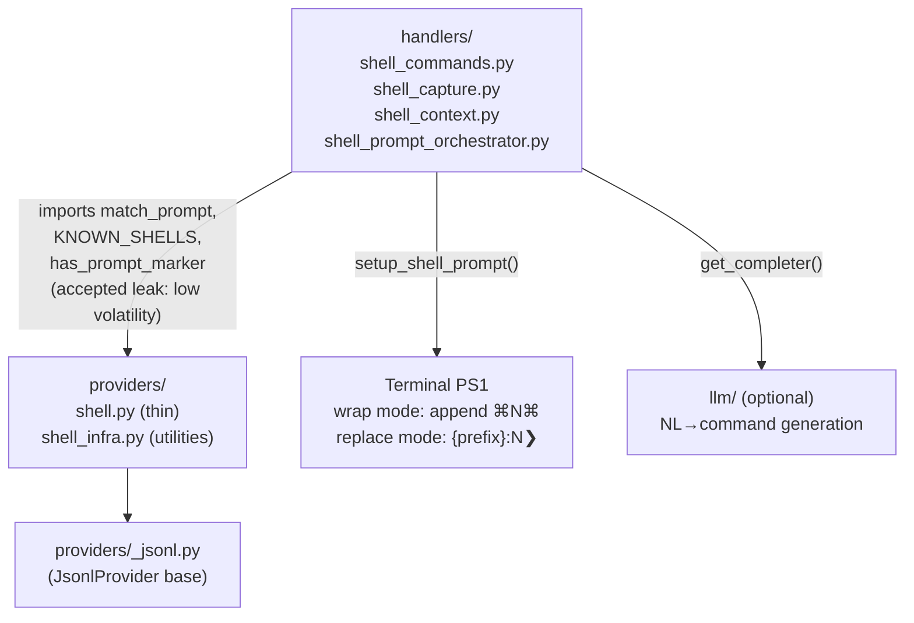
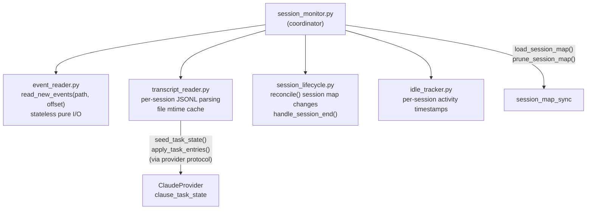
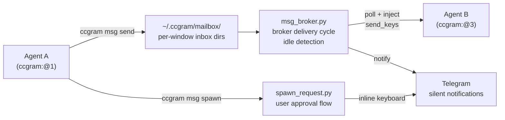

# ccgram Architecture

Generated from code state 2026-05-02 (post Round 5 modularity decouple).

## System Overview

ccgram maps each Telegram Forum topic to one tmux window running one agent CLI (Claude Code, Codex, Gemini, Pi, or Shell). All internal routing is keyed by tmux window ID (`@0`, `@12`).

## Module Layers

## State Flow: Topic → Window → Session

## SessionManager Responsibilities (post round 3)

## Provider Protocol

## Message Routing Flow

## Hook Event Flow

## Shell Provider Architecture

## Session Monitoring Architecture

## Inter-Agent Messaging

## Key Design Decisions

| Decision                                | Rationale                                                                                                                                                                                                                                                                                                                                    |
| --------------------------------------- | -------------------------------------------------------------------------------------------------------------------------------------------------------------------------------------------------------------------------------------------------------------------------------------------------------------------------------------------- |
| Window ID-centric routing (`@0`, `@12`) | Unique within tmux server; window names are display-only                                                                                                                                                                                                                                                                                     |
| Hook-based event system                 | Instant stop/done detection without terminal polling                                                                                                                                                                                                                                                                                         |
| `window_query.py` decoupling layer      | Handlers read window state without importing `SessionManager`                                                                                                                                                                                                                                                                                |
| `session_query.py` decoupling layer     | Handlers resolve sessions without importing `SessionManager`                                                                                                                                                                                                                                                                                 |
| Provider protocol with capability flags | Gate UX features without `if provider == "claude"` checks                                                                                                                                                                                                                                                                                    |
| `supports_task_tracking` capability     | `transcript_reader` is provider-agnostic; Claude implements task state                                                                                                                                                                                                                                                                       |
| Session map direct imports              | Lifecycle handlers use `session_map_sync` directly; no facade needed                                                                                                                                                                                                                                                                         |
| File-based mailbox                      | Agents exchange messages via `~/.ccgram/mailbox/`; broker injects via `send_keys`                                                                                                                                                                                                                                                            |
| Shell leak accepted                     | `match_prompt`, `KNOWN_SHELLS` imports in shell handlers are low-volatility supporting domain — balance rule satisfied by `NOT VOLATILITY`                                                                                                                                                                                                   |
| Tool-call visibility on `WindowState`   | Per-window `tool_call_visibility` (`default`/`shown`/`hidden`) gates `_handle_content_task` before batch eligibility; hook events bypass                                                                                                                                                                                                     |
| Status-mode color schemes               | `CCGRAM_STATUS_MODE` selects `system` (green=working) or `user` (green=ready) — affects only emoji rendering, not internal state names                                                                                                                                                                                                       |
| Gemini JSONL incremental reads          | Gemini CLI v0.40+ uses append-only JSONL; provider inherits `JsonlProvider` byte-offset reader, dedups by message id and pending tool_use                                                                                                                                                                                                    |
| `handlers/` feature subpackages (F1)    | 14 subpackages + documented top-level files instead of 50+ flat peers; each subpackage `__init__.py` re-exports the public surface                                                                                                                                                                                                           |
| Constructor DI for stores (F2)          | `SessionManager` constructs `WindowStateStore`/`ThreadRouter`/`UserPreferences`/`SessionMapSync` with explicit callbacks; no `_wire_singletons` monkey-patch, no `unwired_save` silent default; `register_*_callback` fails loud                                                                                                             |
| `bot.py` factory + lifecycle only (F3)  | 172-line `bot.py`; `handlers/registry.py` owns command/message handler wiring; `bootstrap.py` owns `post_init`/`post_shutdown`                                                                                                                                                                                                               |
| `window_tick/decide,observe,apply` (F4) | Pure decision kernel + pure observer + side-effect applier; `decide_tick` unit-testable without mocks                                                                                                                                                                                                                                        |
| `TelegramClient` Protocol (F5)          | Handlers depend on `TelegramClient` not `telegram.Bot`; `PTBTelegramClient` adapts in production, `FakeTelegramClient` records in tests; only `bot.py`, `bootstrap.py`, `handlers/registry.py`, `telegram_client.py`, `telegram_request.py`, `telegram_sender.py` import from `telegram.ext` at runtime                                      |
| Lazy-import audit (F6)                  | 251 in-function imports → 201; remaining sites carry `# Lazy: <reason>` documenting the cycle path or wiring contract; cycle regressions caught by `tests/integration/test_import_no_cycles.py`                                                                                                                                              |
| Pure types vs stateful polling (R5 F1)  | `polling_strategies.py` deleted; `polling_types.py` (~150 LOC, stdlib + `providers.base.StatusUpdate` only) holds contracts; `polling_state.py` holds strategies + 5 module-level singletons; `decide.py` imports only from `polling_types`. Codified by `test_polling_types_purity.py` (subprocess + AST)                                   |
| Single read path enforcement (R5 F2)    | Handler reads of window/session state go through `window_query` / `session_query`; direct `session_manager.<attr>` in `handlers/**` restricted to write/admin allow-list. AST walk over 86 handler files asserts the rule (`test_query_layer_only_for_handlers.py`)                                                                          |
| Recovery split (R5 F3)                  | `recovery_callbacks.py` shrunk to ~170-LOC dispatcher (routing + shared validators); `recovery_banner.py` (~450 LOC dead-window UX) + `resume_picker.py` (~400 LOC resume UX + transcript scan) are siblings. `recovery/__init__.py` re-exports unchanged; pinned by `test_recovery_subpackage_surface.py`                                   |
| Commands subpackage (R5 F4)             | `command_orchestration.py` deleted; `handlers/commands/` follows `shell/` pattern: `forward.py`, `menu_sync.py`, `failure_probe.py`, `status_snapshot.py`. `commands/__init__.py` hosts `commands_command` + `toolbar_command`; pinned by `test_commands_subpackage_surface.py`                                                              |
| Lazy-import lint enforcement (R5 F5)    | `scripts/lint_lazy_imports.py` AST-walks `src/ccgram/**/*.py` and fails any in-function import without `# Lazy:` (or inside `if TYPE_CHECKING:` / `_reset_*_for_testing`). Walker recurses through compound statements (incl. `except*`) and nested `def`/`class` bodies. All 250 sites annotated. Cycle test expanded from 29 → 162 modules |
| Topic binding helper                    | `handlers/topics/topic_binding.py` owns the small repeated bind+rename steps shared by new-session and recovery flows; window creation, provider setup, and pending-message delivery stay in the caller-specific handlers                                                                                                                   |
