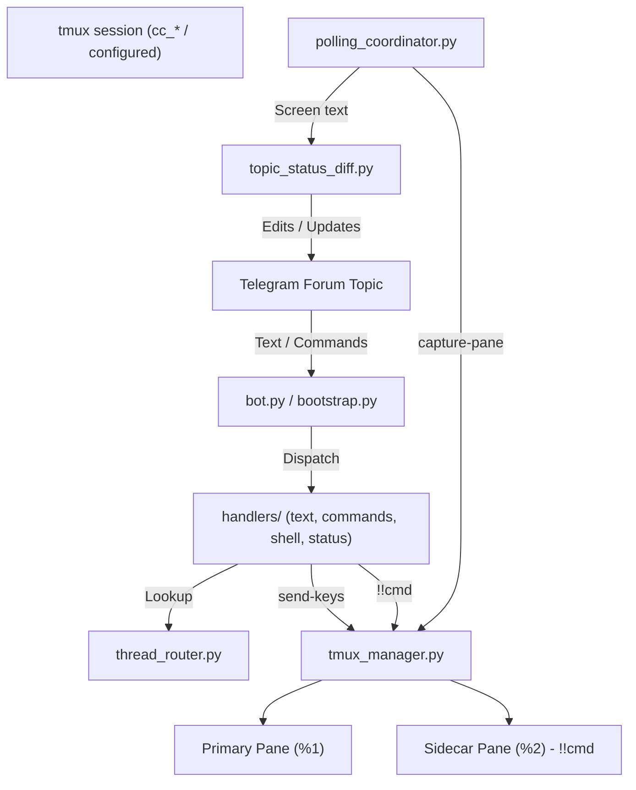

# ccgram Architecture (`refactor/tmux-only`)

## System Overview

ccgram bridges Telegram Forum topics to tmux sessions running user shells.
Each Telegram Forum topic maps directly to one tmux session (with a dedicated window and primary pane).

```text
Telegram Topic <───> ccgram <───> tmux session / window <───> Shell / CLI
```

### Core Invariants

1. **One Topic = One Session**: A Telegram topic is bound to exactly one tmux window/session.
2. **Tmux as the Source of Truth**: The active state and screen buffer live inside tmux, polled via `capture-pane`.
3. **Pure Shell Provider**: No AI-agent runtimes, hooks, transcript watchers, or status line regex heuristics.
4. **Sidecar Execution (`!!<command>`)**: Running a clean command inside an existing session opens a dedicated secondary sidecar pane, captures output via diff, and closes it upon completion, keeping the primary pane undisturbed.
5. **Direct Explicit Teardown**: No indirect cleanup registries. `clear_topic_state` directly tears down topic, chat, window, and mailbox state.


```mermaid
graph TB
    Telegram["Telegram Forum Topic"]
    Bot["bot.py / bootstrap.py"]
    Router["thread_router.py"]
    Handlers["handlers/ (text, commands, shell, status)"]
    TmuxMgr["tmux_manager.py"]
    TmuxSession["tmux session (cc_* / configured)"]
    PrimaryPane["Primary Pane (%1)"]
    SidecarPane["Sidecar Pane (%2) - !!cmd"]
    PollCoordinator["polling_coordinator.py"]
    DiffEngine["topic_status_diff.py"]

    Telegram -- "Text / Commands" --> Bot
    Bot -- "Dispatch" --> Handlers
    Handlers -- "Lookup" --> Router
    Handlers -- "send-keys" --> TmuxMgr
    Handlers -- "!!cmd" --> TmuxMgr
    TmuxMgr --> PrimaryPane
    TmuxMgr --> SidecarPane
    PollCoordinator -- "capture-pane" --> TmuxMgr
    PollCoordinator -- "Screen text" --> DiffEngine
    DiffEngine -- "Edits / Updates" --> Telegram
```

---

## Directory Structure & Component Layers

```text
src/ccgram/
├── bot.py                  # PTB Application factory and lifecycle hooks
├── bootstrap.py            # Startup validation and worker task spawning
├── config.py               # Environment configuration and allowlists
├── thread_router.py        # Mapping between (user_id, thread_id) and window_id/chat_id
├── tmux_manager.py         # libtmux wrapper: session lifecycle, send-keys, sidecar panes
├── mailbox.py              # Inter-session communication mailbox directory
├── handlers/
│   ├── cleanup.py          # Unified explicit topic/session teardown
│   ├── text/               # Text message handling (regular input -> send-keys)
│   ├── shell/              # Shell commands: bang commands, sidecar execution (!!)
│   ├── send/               # Inter-session messaging (//send)
│   ├── status/             # Status diff formatting and bubble updates
│   ├── polling/            # Periodic background polling: screen diffs & liveliness
│   ├── live/               # Live screen streaming and screenshot captures
│   └── messaging_pipeline/ # Rate-limiting, queuing, and Telegram message dispatch
```

---

## Key Subsystems

### 1. Terminal Polling & Screen Diff
- **`polling_coordinator.py`**: Executes the background poll loop across all active sessions.
- **`TerminalScreenBuffer`**: Caches screen contents, content hashes, and pyte screen representations.
- **`topic_status_diff.py`**: Computes diffs between screen captures, formatting changes as readable code blocks in Telegram.
- **Sidecar Stream**: Sidecar panes (`!!<cmd>`) maintain their own diff tracking, updating a dedicated Telegram message with the command output.

### 2. Message Dispatch & Sidecar Routing
- **Standard Input**: Regular messages in the topic are sent directly to the primary pane using tmux `send-keys`.
- **Sidecar (`!!<cmd>`)**:
  - Checks if a sidecar pane already exists. If not, splits the tmux window (`tmux split-window -v`).
  - Launches the requested command and tracks its PID and pane ID.
  - Diff stream renders specifically for the sidecar message with a clear sidecar header.
  - On command exit, the sidecar pane is automatically closed.
- **Inter-session (`//send`)**:
  - Sends messages and files between sessions using the `Mailbox` file queue mechanism.

### 3. Topic Lifecycle & Cleanup
- When a topic is closed or unbound (`//unbind` or `/close`):
  - `clear_topic_state(user_id, thread_id, ...)` is called.
  - Explicit teardown functions for topic history, live views, pending shell commands, screen buffers, toolbar states, and mailboxes run in deterministic order with exception protection (`_safe_call`).
